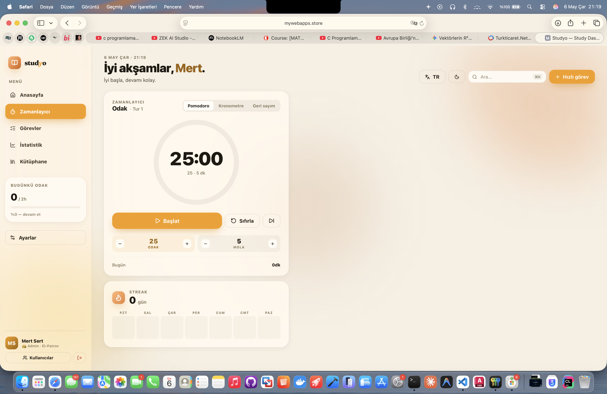
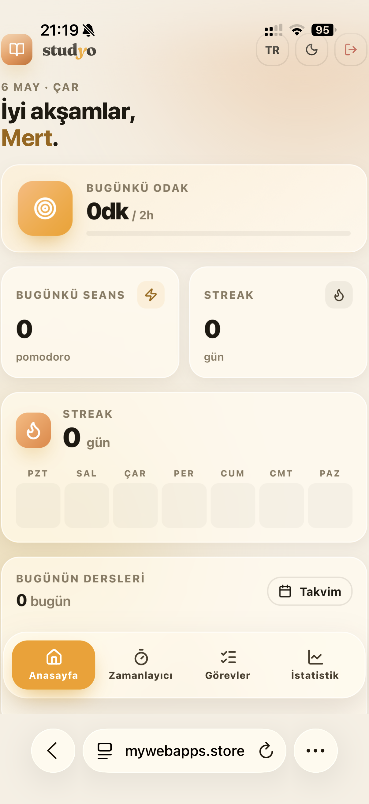

# Studyo

<p align="center">
  
  
  
  
  
  
</p>

> **Studyo** — Öğrenciler için tasarlanmış, odak zamanlayıcısı, görev yöneticisi, istatistik takibi ve şifreli dosya kütüphanesini tek çatı altında toplayan self-hosted çalışma panosu.  
> *A self-hosted study dashboard unifying a focus timer, task manager, statistics and an encrypted file library — built for students.*

**Live demo:** [mywebapps.store/studyo](https://mywebapps.store/studyo)

---

## İçindekiler / Table of Contents

- [Özellikler / Features](#özellikler--features)
- [Ekran Görüntüleri / Screenshots](#ekran-görüntüleri--screenshots)
- [Teknoloji Yığını / Tech Stack](#teknoloji-yığını--tech-stack)
- [Güvenlik Mimarisi / Security Architecture](#güvenlik-mimarisi--security-architecture)
- [Hızlı Başlangıç / Quick Start](#hızlı-başlangıç--quick-start)
- [Ortam Değişkenleri / Environment Variables](#ortam-değişkenleri--environment-variables)
- [Proje Yapısı / Project Structure](#proje-yapısı--project-structure)
- [API Referansı / API Reference](#api-referansı--api-reference)
- [Dağıtım / Deployment](#dağıtım--deployment)
- [Lisans / License](#lisans--license)

---

## Özellikler / Features

### 🍅 Pomodoro & Zamanlayıcı / Timer

| Mod | Açıklama |
|-----|----------|
| **Pomodoro** | Yapılandırılabilir odak (5–90 dk) ve mola (1–30 dk) döngüleri |
| **Kronometre** | Serbest süre takibi |
| **Geri Sayım** | Sabit hedef süresi (1–180 dk) |

- Animasyonlu dairesel ilerleme çubuğu  
- Otomatik faz geçişi (Odak → Mola → Odak…)  
- Günlük odak dakikası birikimi

### ✅ Görev Yönetimi / Task Management

- Kurs bazlı görev oluşturma (ad, kurs, tahmini süre, öncelik)
- Öncelik renk kodlaması: Yüksek / Orta / Düşük
- Tamamlananları ayrı listelemek için filtre
- Sürükle-bırak sıralama (klavye desteğiyle)

### 📊 İstatistikler & Aktivite / Statistics & Activity

- **Günlük Odak Sayacı** — saatlik hedef çubuğu ile
- **Haftalık Bar Grafik** — 7 günlük odak dakikası
- **Aktivite Haritası (Heatmap)** — 13 hafta × 7 gün, 5 yoğunluk seviyesi
- **Streak** — ardışık aktif gün sayacı
- Stat kartları: en uzun seans, tamamlama oranı, en iyi gün

### 📅 Ders Programı / Class Schedule

- Günlük ders kartları (oda, başlangıç/bitiş saati, renk etiketi)
- Gerçek zamanlı durum: **Bitti / Şimdi / Sıradaki**

### 📝 Hızlı Not / Quick Notes

- Kalıcı, formatsız metin alanı (20.000 karakter)
- Sunucuya şifreli olarak kaydedilir

### 🎵 Ortam Sesleri / Ambient Sounds

Yağmur · Kafe · Orman · Şömine · Deniz · Klavye

### 📁 Dosya Kütüphanesi / Encrypted File Library

- Dosya başı **256 MB** limitiyle yükleme
- Sunucuda **AES-256-GCM** ile şifrelenmiş depolama
- Her kullanıcı yalnızca kendi dosyalarına erişir
- Güvenli uzantı engel listesi (`.js`, `.php`, `.exe` vb.)

### 👤 Kimlik Doğrulama / Authentication

- E-posta + şifre ile kayıt/giriş
- İlk çalıştırmada **kurulum sihirbazı** (admin hesabı oluşturur)
- `httpOnly` + `SameSite=Strict` JWT cookie
- Brute-force koruması: giriş 10/15 dk, kayıt 5/saat

### 🔧 Yönetici Paneli / Admin Panel

- Tüm kullanıcıları listeleme
- Rol atama (`admin` / `user`)
- Hesap devre dışı bırakma / silme (dosyalar dahil)

### 🌐 Çoklu Dil & Tema / i18n & Theming

- **Türkçe** ve **İngilizce** tam çeviri
- Açık / Koyu tema  
- Sıkışık / Ferah yoğunluk  
- Vurgu rengi seçici

---

## Ekran Görüntüleri / Screenshots

| Masaüstü / Desktop | Mobil / Mobile |
|---|---|
|  |  |

---

## Teknoloji Yığını / Tech Stack

### Backend

| Katman | Teknoloji |
|--------|-----------|
| Runtime | Node.js ≥ 18 |
| Web çerçevesi | Express 4 |
| Kimlik doğrulama | jsonwebtoken (HS256, 7 gün) + bcrypt (12 round) |
| Şifreleme | Node.js `crypto` — AES-256-GCM |
| Dosya yükleme | multer (disk storage → şifreli depolama) |
| Güvenlik başlıkları | helmet (CSP, X-Frame-Options, MIME-sniffing vb.) |
| Rate limiting | express-rate-limit |
| Cookie | cookie-parser |
| Veri deposu | JSON dosya tabanlı (atomic write, şifreli payload) |

### Frontend

| Katman | Teknoloji |
|--------|-----------|
| UI kütüphanesi | React 18 (CDN — derleme adımı yok) |
| JSX transpiler | Babel standalone (tarayıcıda) |
| İkonlar | Lucide Icons (CDN) |
| Stiller | Vanilla CSS (CSS custom properties, glassmorphism) |

> **Neden derleme adımı yok?**  
> Proje, sıfır araç kurulumu ile herhangi bir Node.js ortamında çalışacak şekilde tasarlanmıştır. `node server.js` yeterlidir.

---

## Güvenlik Mimarisi / Security Architecture

```
┌─────────────────────────────────────────────────────┐
│                     İstemci                         │
│  React SPA  ←→  httpOnly JWT Cookie (SameSite=Strict)│
└────────────────────────┬────────────────────────────┘
                         │ HTTPS (prod)
┌────────────────────────▼────────────────────────────┐
│                    Express API                       │
│  Helmet CSP  │  Rate Limiter  │  requireAuth/Admin   │
└────────────────────────┬────────────────────────────┘
                         │
┌────────────────────────▼────────────────────────────┐
│              Veri Katmanı (JSON dosyası)              │
│  Uygulama durumu: AES-256-GCM şifreli JSON           │
│  Dosyalar: AES-256-GCM şifreli binary                │
│  Şifreler: bcrypt (cost=12)                          │
└─────────────────────────────────────────────────────┘
```

| Tehdit | Koruma |
|--------|--------|
| XSS | `httpOnly` cookie, Helmet CSP |
| CSRF | `SameSite=Strict` cookie |
| Brute-force girişi | Rate limiter (10 deneme / 15 dk) |
| Timing saldırısı | Her zaman `bcrypt.compare` çalışır (dummy hash) |
| Kötü amaçlı yükleme | Uzantı engel listesi + MIME doğrulama |
| Dosya sızıntısı | Her dosya AES-256-GCM ile şifrelenir, kullanıcı izole |
| Gizli yönetim | `JWT_SECRET` ve `APP_DATA_KEY` otomatik üretilir, `.env`'e yazılır |

---

## Hızlı Başlangıç / Quick Start

### Gereksinimler

- **Node.js ≥ 18** (`node --version` ile kontrol edin)
- `npm` veya `pnpm`

### Kurulum

```bash
# 1. Klonla
git clone https://github.com/MrtSrt31/studyo.git
cd studyo

# 2. Bağımlılıkları kur
npm install

# 3. Ortam dosyasını oluştur
cp .env.example .env
# (opsiyonel) .env içindeki değerleri düzenle

# 4. Başlat
npm start
```

Sunucu başlarken:
- `.env` yoksa otomatik oluşturulur  
- `JWT_SECRET` ve `APP_DATA_KEY` yoksa rastgele üretilir ve `.env`'e kaydedilir  
- Tarayıcı `http://localhost:3000/studyo` adresinde otomatik açılır  
- **İlk açılışta kurulum ekranı gelir** — admin hesabını oluşturun

```
  studyo  →  http://localhost:3000/studyo/
```

### Geliştirme modu (hot reload)

```bash
npm run dev
```

---

## Ortam Değişkenleri / Environment Variables

| Değişken | Zorunlu | Açıklama | Varsayılan |
|----------|---------|----------|------------|
| `PORT` | hayır | HTTP port numarası | `3000` |
| `APP_BASE_PATH` | hayır | Uygulama URL ön eki | `/studyo` |
| `JWT_SECRET` | otomatik | JWT imzalama anahtarı (≥64 karakter) | *otomatik üretilir* |
| `APP_DATA_KEY` | otomatik | AES-256 veri şifreleme anahtarı (base64, 32 byte) | *otomatik üretilir* |
| `DATA_FILE_PATH` | hayır | JSON veri deposu yolu | `./storage/app-data.json` |
| `NODE_ENV` | hayır | `production` → HTTPS cookie zorlanır | `development` |

> **Not:** `JWT_SECRET` veya `APP_DATA_KEY` tanımlı değilse sunucu bunları otomatik üretir. Üretim ortamında `.env` dosyasını kendiniz belirleyin ve kesinlikle gizli tutun.

---

## Proje Yapısı / Project Structure

```
studyo/
│
├── server.js                # Express API — auth, dosya, admin endpoint'leri
├── app.html                 # Uygulama shell (React bağlantıları, Babel transpile)
├── home.html                # Ana sayfa / proje dizini
├── index.html               # Proje listesi landing sayfası
│
├── app-core.jsx             # Paylaşılan state, i18n (TR/EN), demo veri, yardımcılar
├── desktop.jsx              # Masaüstü düzeni (sidebar + grid)
├── mobile.jsx               # Mobil düzen (tab bar navigation)
├── widgets-timer-tasks.jsx  # Pomodoro, görev listesi, müzik widget'ları
├── widgets-rest.jsx         # Streak, haftalık grafik, heatmap, program, not widget'ları
├── tweaks-panel.jsx         # Tasarım düzenleme paneli (density, renk, dil, tema)
├── ios-frame.jsx            # Tasarım kanvası için iOS telefon çerçevesi
├── design-canvas.jsx        # Masaüstü/Mobil önizleme kanvası
│
├── styles.css               # Ana CSS (CSS custom properties, glass-morphism)
├── tokens.css               # Design token'lar (renkler, boşluklar, tiografi)
│
├── storage/
│   ├── app-data.json        # Kullanıcı, state ve dosya meta verisi (şifreli)
│   ├── uploads/             # AES-256-GCM ile şifreli dosyalar (kullanıcı ID / dosya)
│   └── tmp/                 # Yükleme geçici dizini (otomatik temizlenir)
│
├── .env                     # Gizli değerler — asla commit etme!
├── .env.example             # Şablon
└── package.json
```

---

## API Referansı / API Reference

Tüm API endpoint'leri `APP_BASE_PATH` (varsayılan `/studyo`) altındadır.

### Kimlik Doğrulama / Auth

| Method | Endpoint | Auth | Açıklama |
|--------|----------|------|----------|
| `GET` | `/api/setup-status` | — | İlk kurulum gerekip gerekmediğini döner |
| `POST` | `/api/setup` | — | İlk admin hesabını oluşturur (yalnızca 1 kez) |
| `POST` | `/api/register` | — | Yeni kullanıcı kaydı (5/saat limit) |
| `POST` | `/api/login` | — | Giriş, JWT cookie set eder (10 deneme / 15 dk) |
| `POST` | `/api/logout` | ✓ | Cookie'yi temizler |
| `GET` | `/api/me` | ✓ | Mevcut kullanıcı bilgisi |

### Uygulama Durumu / App State

| Method | Endpoint | Auth | Açıklama |
|--------|----------|------|----------|
| `GET` | `/api/app-state` | ✓ | Şifrelenmiş durumu çözer ve döner |
| `PUT` | `/api/app-state` | ✓ | Durumu doğrular, şifreler ve kaydeder |

**State şeması:**
```json
{
  "tasks":      [],
  "notes":      "",
  "classes":    [],
  "week":       [0,0,0,0,0,0,0],
  "heatmap":    [0, ...],
  "days7":      [0,0,0,0,0,0,0],
  "todayFocus": 0,
  "timer":      { "focusMin": 25, "restMin": 5, "countMin": 30 },
  "appearance": { "accentColor": "#007AFF" },
  "goalHours":  4
}
```

### Dosyalar / Files

| Method | Endpoint | Auth | Açıklama |
|--------|----------|------|----------|
| `GET` | `/api/files` | ✓ | Kullanıcının dosya listesi (meta veri) |
| `POST` | `/api/files/upload` | ✓ | Dosya yükleme (multipart, maks 256 MB) |
| `GET` | `/api/files/:id/download` | ✓ | Dosyayı şifreli akışla indirir |
| `DELETE` | `/api/files/:id` | ✓ | Dosyayı meta veri ve diskten siler |

### Yönetici / Admin

| Method | Endpoint | Auth | Açıklama |
|--------|----------|------|----------|
| `GET` | `/api/admin/users` | admin | Tüm kullanıcıları listele |
| `PATCH` | `/api/admin/users/:id` | admin | Rol veya aktiflik güncelle |
| `DELETE` | `/api/admin/users/:id` | admin | Kullanıcıyı ve dosyalarını sil |

---

## Dağıtım / Deployment

### Reverse Proxy (Nginx) Örneği

```nginx
location /studyo {
    proxy_pass         http://127.0.0.1:3000;
    proxy_http_version 1.1;
    proxy_set_header   Upgrade $http_upgrade;
    proxy_set_header   Connection keep-alive;
    proxy_set_header   Host $host;
    proxy_cache_bypass $http_upgrade;
    client_max_body_size 260m;
}
```

### Üretim Ortamı Kontrol Listesi

- [ ] `.env` dosyasında `NODE_ENV=production` ayarla
- [ ] `JWT_SECRET` en az 64 rastgele karakter içermeli
- [ ] `APP_DATA_KEY` 32-byte, base64 kodlu olmalı
- [ ] `storage/` dizini dışarıdan erişilemez olmalı
- [ ] Nginx/Caddy ile TLS (HTTPS) yapılandır
- [ ] `storage/app-data.json` ve `storage/uploads/` için yedek al
- [ ] Firewall: yalnızca 80/443 portlarını dışa aç

### PM2 ile Çalıştırma

```bash
npm install -g pm2
pm2 start server.js --name studyo
pm2 save
pm2 startup
```

---

## Geliştirme Notları / Development Notes

### Veri Deposu

Proje bir **JSON dosya tabanlı veri deposu** kullanır (`storage/app-data.json`). SQLite veya başka bir veritabanı gerektirmez; her yazma işlemi atomic (geçici dosya + rename) şekilde gerçekleştirilir.

### Gizli Anahtar Yönetimi

`server.js` başlarken `.env` dosyasını okur. `JWT_SECRET` veya `APP_DATA_KEY` eksikse:
1. `crypto.randomBytes()` ile güvenli anahtar üretir.  
2. Anahtarı `.env`'e yazar.  
3. Terminale bilgi mesajı yazdırır.

Bu sayede ilk kurulumda ek adım gerekmez.

### Frontend Mimarisi

React, Babel ve Lucide CDN üzerinden yüklenir; derleme aracı (`webpack`, `vite` vb.) yoktur. Tüm bileşenler browser'da transpile edilir. Bu yaklaşım:
- Bağımlılık karmaşıklığını sıfıra indirir  
- Sunucu üzerinde doğrudan düzenlemeye olanak tanır  
- CI/CD pipeline gerektirmez

---

## Lisans / License

MIT © 2025 — Mert Sert  

---

<p align="center">
  Made with ☕ & 🍅 — <a href="https://mywebapps.store/studyo">mywebapps.store/studyo</a>
</p>
